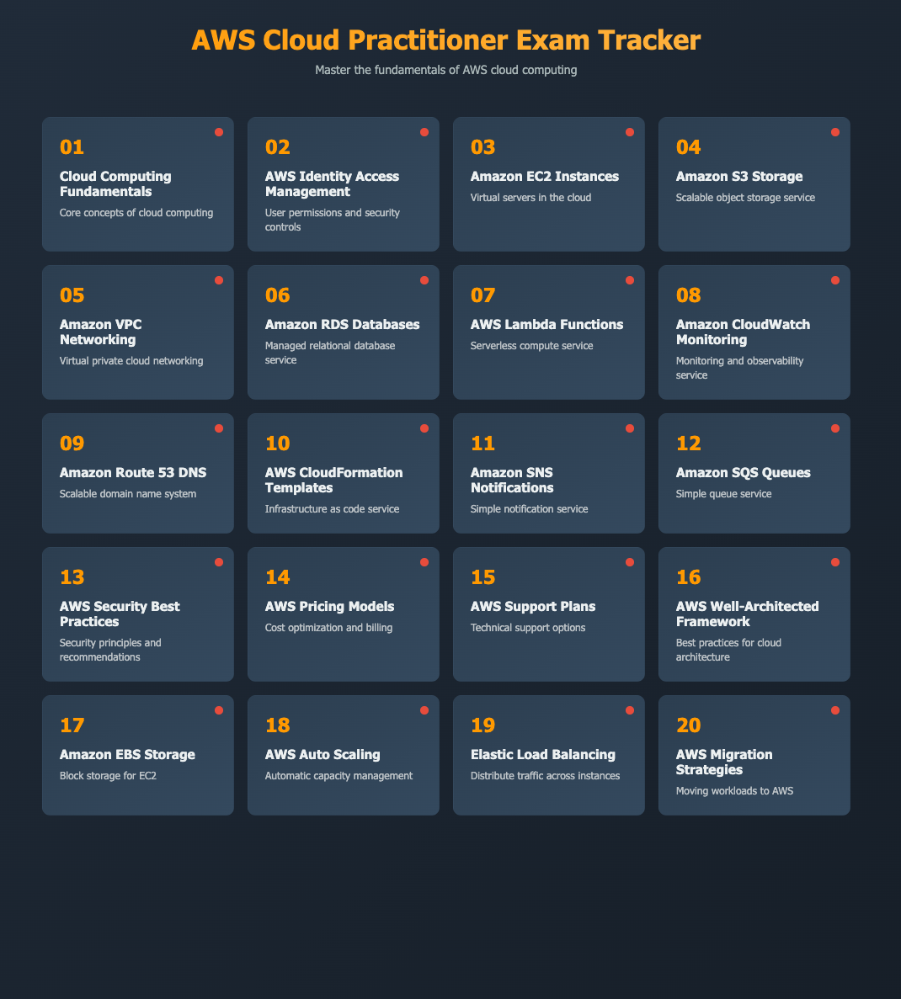

# UNIT CONVERTER

[click here to go to the website](https://verson-tech.github.io/cloud-practitioner-exam-prep/)

## Description

This project is a progeress tracker for the AWS Certified Cloud Practitioner exam preparation. It provides a user-friendly interface to track your study progress, manage resources, and access exam-related materials.

## Features

This project does not have a database to store user data. Instead, it uses local storage to save user progress and preferences. This means that your data is stored in your browser and will not be accessible from other devices or browsers. The data will be reset if you clear your browser's local storage. However, to ensure the progress is visible the progress-indicator color may be changed to green for each tile manually by hardcoding the value in the code of the css file.
