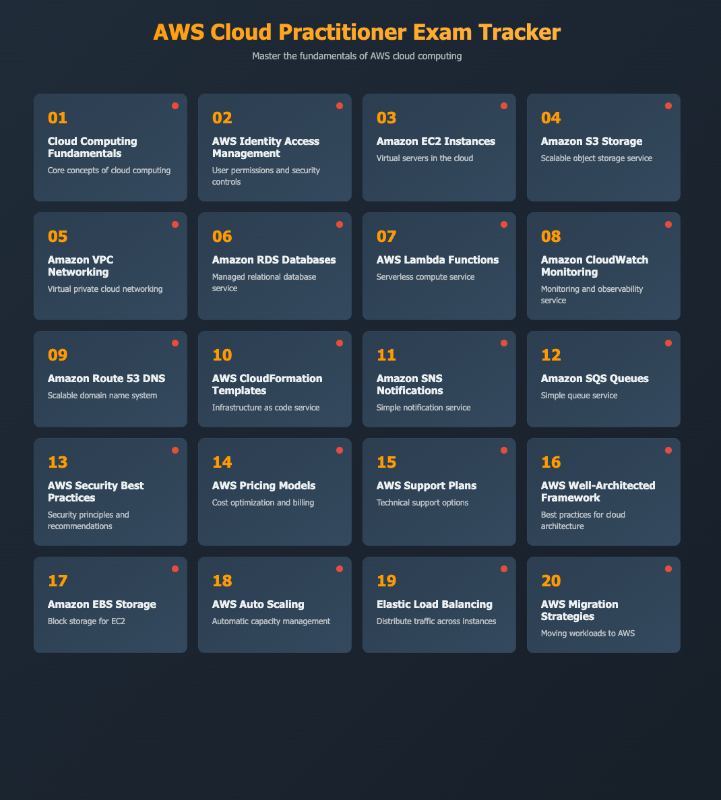

# AWS Certified Cloud Practitioner Exam Prep Progress Tracker

[click here to go to the website](https://verson-tech.github.io/cloud-practitioner-exam-prep/)

## Description

This project is a progeress tracker for the AWS Certified Cloud Practitioner exam preparation. It provides a user-friendly interface to track your study progress, manage resources, and access exam-related materials.

## Features

This project does not have a database to store user data. Instead, it uses local storage to save user progress and preferences. This means that your data is stored in your browser and will not be accessible from other devices or browsers. The data will be reset if you clear your browser's local storage. However, to ensure the progress is visible the progress-indicator color may be changed to green for each tile manually by hardcoding the value in the code of the css file.

---

5.  Amazon VPC Networking
    Close
    Description
    Amazon Virtual Private Cloud (VPC) lets you provision a logically isolated section of the AWS Cloud where you can launch AWS resources in a virtual network that you define. You have complete control over your virtual networking environment, including selection of your own IP address range, creation of subnets, and configuration of route tables and network gateways.
    Code Examples & CLI Commands

# Create VPC

                        aws ec2 create-vpc --cidr-block 10.0.0.0/16

                        # Create subnet
                        aws ec2 create-subnet --vpc-id vpc-12345678 --cidr-block 10.0.1.0/24

                        # Create internet gateway
                        aws ec2 create-internet-gateway
